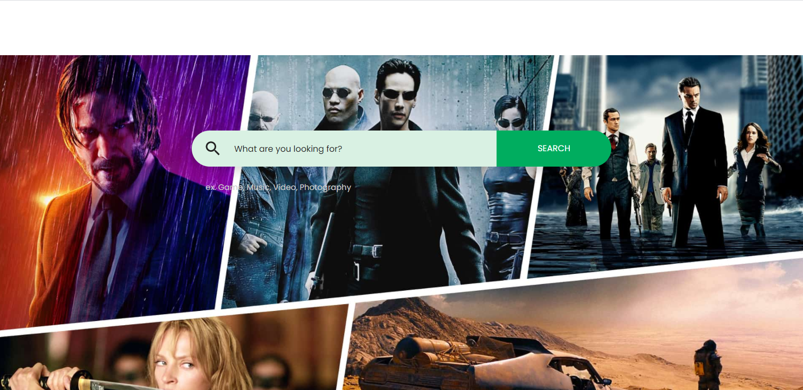
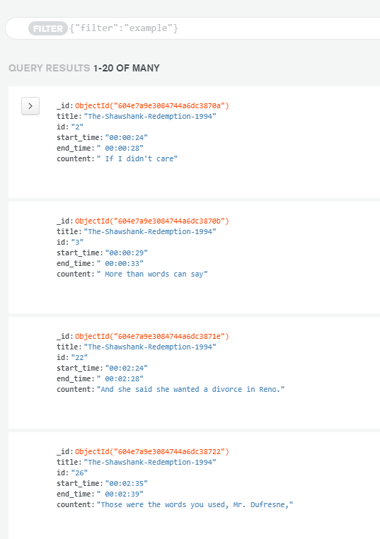

# Moiel
Search txt in movies  
We haye main.py to download subtitle and make in to json and then upload to mongodb database at the end we can search it trough  

If you think use JavaScript to search for elements its true and in the other_way folder  

*You can make a site and its in the site folder*  
sit looks like this:

and database looks like this:

